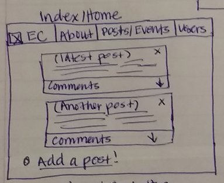

#Expat Connection

####Intro
Expat Connection will be an app for expatriates (a person who lives outside of their native country) to connect with other expats in their area. This app is intended for users to publish posts in order to find other people from a common home city/country and/or current city and/or language(s) to find each other and form friendships and build a community. In these posts, users will be able to publish comments to interact with other users; users may also post events to meet up with other members.

####ERD

####Wireframes

####Check out the user stories for this game on my [Trello](https://trello.com/b/Gc2KbHP5/wdi-sm-43-project-2)!

####Technologies used:
+ HTML
+ CSS
+ Ruby on Rails
+ Bootstrap

####Approach
Three main models will be used to reach the MVP for this app: User, Post, and Comment. The main model will be posts, as it will be the main thing bringing users together. Users will have an optional field to fill in regarding event location/hours/theme in case they are planning to get together at a certain place for whatever purpose they wish. Users will be able to enter some facts about themselves a log with a bio in order for other users to learn about them. Comments will be enabled with a date & timestamp so that users are aware of how relevant/current they are.

####Stretch Goals
If time permits, members will be able to perform the following actions:

+ Upload a profile picture
+ Member since feature
+ Add multiple countries/languages they identify with
+ Like posts
+ Like comments
+ Filter users by current city/home city/home country/language
+ Choose from a dropdown of themes including
	+ Food
	+ Dance
	+ Bar/Drinks
	+ Literature
	+ Art
	+ Movies/TV
	+ Sports & Exercise
	+ Fitness & Health
	+ Academia
	+ Geek Stuff
+ Filter posts by theme and/or location/date of event

####Installation Instructions
TBA on demo day!

####Link to Github Repo: [Github Repo] (https://github.com/rubisc/WDI_Project2_ExpatConnection)
